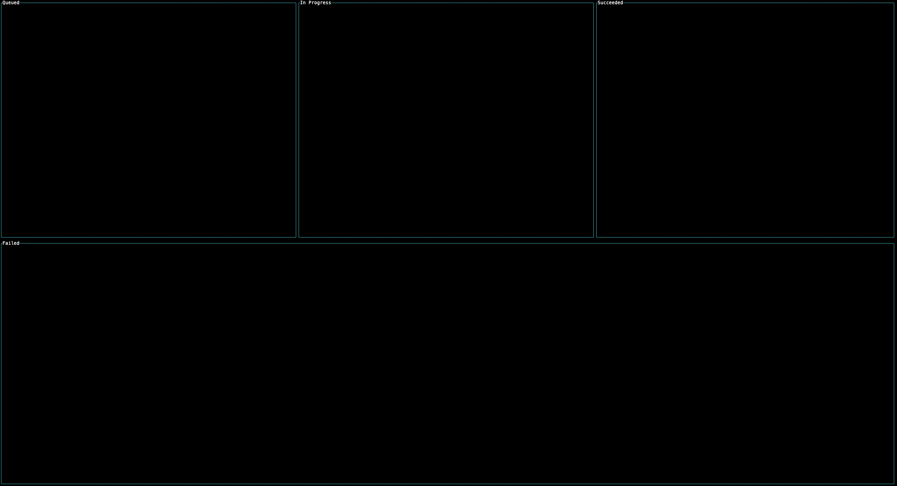

# gh-migration-monitor

`gh-migration-monitor` is a [GitHub CLI](https://cli.github.com) that monitors the progress of a GitHub Organization migrations. It is inspired by another migration monitor app, [github-migration-monitor](https://github.com/timrogers/github-migration-monitor).

## Installation

```bash
gh extension install mona-actions/gh-migration-monitor
```

## Usage

```bash
Usage:
gh migration-monitor [flags]

Flags:
  -t, --github-token string   Github token to use
  -h, --help                  help for migration-monitor
  -o, --organization string   Organization to monitor
  -l, --legacy                If the migration is a legacy migration, you need to provide this flag to monitor legacy migrations
```

## Example

The image below shows the output of the `gh migration-monitor` command and how the progress of the migration is displayed.



> [!TIP]
> You can quickly change focus to Queued, In Progress, Succeeded, or Failed migrations by pressing the `q`, `i`, `s`, or `f` keys respectively.

## License

- [MIT](./license) (c) [Mona-Actions](https://github.com/mona-actions)
- [Contributing](./contributing.md)
